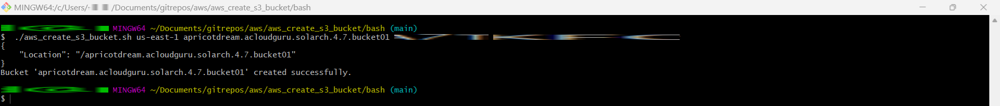
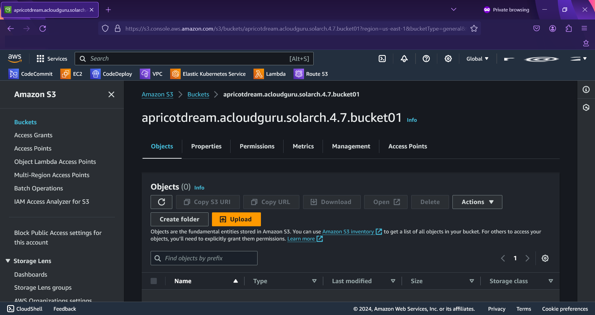
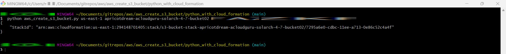

# aws_create_s3_bucket

Scripts to create an S3 bucket in AWS.

Parameters:

Region

Bucket Name

Access Key Id

Secret Access Key

## Bash

Creates the bucket.

## Python with CloudFormation

Creates a CloudFormation stack with the bucket inside.

## Tests

### Bash

### Python with CloudFormation

